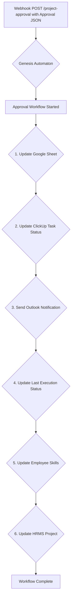

# Genesis Automaton: Project Approval Workflow (approval_workflow.py)

This README documents the project approval workflow implemented in `src/core/approval_workflow.py`. This workflow is triggered when a project is approved and handles updating various systems and notifying stakeholders.

## Project Overview

The approval workflow is an automated process that takes over after a project has been given the green light. It ensures that the project's status is updated across different platforms, relevant data is logged, and notifications are sent to the team. This workflow is triggered by a webhook, which receives the project approval data.

## Core Features (Approval Workflow)

*   **Google Sheet Logging**: Appends a new row with the project approval details to a designated Google Sheet for tracking and auditing purposes.
*   **ClickUp Status Update**: Automatically changes the status of the corresponding ClickUp task to "DEVELOPMENT" to reflect that the project is now active.
*   **Outlook Notifications**: Sends a detailed notification to a specific Outlook thread, informing the team about the project's approval and key details.
*   **HRMS Project Update**: Updates the project's details in the HRMS system, including start date, status, project manager, allocated hours, and expected delivery date.
*   **Database Persistence**: Updates the `LastExecution` status to "Approval" in the project database to track the project's lifecycle.
*   **Employee Skill Update**: Updates the skills of the team members assigned to the project in the database.

## System Workflow

The approval workflow is a sequential, automated pipeline triggered by `POST /project-approval`.

## Detailed Step Map

1.  **Update Google Sheet**: Appends a new row with the project approval data to the "Project Approval Submissions" sheet in Google Sheets.
2.  **Update ClickUp Task Status**: Sets the.status of the ClickUp task associated with the project to "DEVELOPMENT".
3.  **Send Outlook Notification**: Replies to an existing Outlook post with a message containing the project approval details.
4.  **Update Last Execution Status**: Updates the `LastExecution` field for the project in the database to "Approval".
5.  **Update Employee Skills**: Adds the project's skills to the profiles of the employees assigned to the project in the database.
6.  **Update HRMS Project**: Updates the project's information in the HRMS system with the latest details from the approval data.

## Technology Stack

| Category          | Technology / Library                                                                                             |
| ----------------- | ---------------------------------------------------------------------------------------------------------------- |
| **Web Framework**   | aiohttp                                                                    |
| **Data Validation** | Pydantic                                                                            |
| **Configuration**   | python-dotenv                                                       |
| **APIs & Services** | Google Sheets API, ClickUp API, Microsoft Graph API (Outlook), HRMS API                |
| **API Clients**     | `gspread`, `requests`, `msal`                                 |

## API Endpoint (Approval Workflow Trigger)

### POST /project-approval

Initiates the project approval workflow. Returns immediately after queuing background execution.

*   **Payload**: JSON matching `src/models/project_approval.py`.
*   **Success (200)**:
    `{ "status": "accepted" }`
*   **Error (400)**:
    `{ "status": "error", "message": "..." }`
