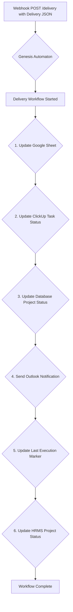

# Genesis Automaton: Project Delivery Workflow (delivery_workflow.py)

This README documents the project delivery workflow implemented in `src/core/delivery_workflow.py`. This workflow is triggered when a project is ready for payment and handles status updates and notifications across integrated platforms.

Genesis Automaton is a webhook-driven system that automates key phases of the project lifecycle. The delivery workflow marks the transition from internal development to client-side validation, ensuring all systems of record are updated accordingly.

## Project Overview

The delivery workflow is initiated by a webhook, which carries data about the delivered project. This data is used to update the project's status in various systems, notify stakeholders, and log the delivery details for tracking and reporting.

## Core Features (Delivery Workflow)

*   **Webhook-Driven Automation**: A single `POST` request to the delivery endpoint triggers the entire workflow.
*   **Google Sheets Logging**: Appends a new row to a designated Google Sheet with comprehensive details of the project delivery.
*   **ClickUp Status Update**: Automatically changes the status of the corresponding ClickUp task to "Payment Pending".
*   **Database Status Update**: Updates the project's status in the central project database to "Payment Pending".
*   **Rich Outlook Notifications**: Sends a detailed, HTML-formatted notification to a specific Outlook conversation thread, including points of contact, resource links, and a delivery message.
*   **HRMS Status Update**: Updates the project status in the HRMS portal to "Payment Pending".
*   **Execution Tracking**: Updates a `LastExecution` field in the database to signify that the delivery workflow was the last major action performed.

## System Workflow

The delivery workflow is a sequential, automated pipeline triggered by a webhook.



**Detailed Step Map:**

1.  **Update Google Sheet**: A new row is appended to the "Project Delivery Submissions" sheet with the timestamp, submitter's email, project name, resource URLs, points of contact, and the delivery message.
2.  **Update ClickUp Status**: The status of the project's task in ClickUp is set to "Payment Pending".
3.  **Update Database Status**: The project's status field in the internal database is updated to "Payment Pending".
4.  **Send Outlook Notification**: A formatted HTML message is sent as a reply to a specific Outlook post associated with the project, ensuring the notification appears in the correct context.
5.  **Update Last Execution**: The `LastExecution` field for the project in the database is set to "Delivery".
6.  **Update HRMS Status**: The project's status in the HRMS system is updated to "Payment Pending".

## Technology Stack

| Category          | Technology / Library                                                                                             |
| ----------------- | ---------------------------------------------------------------------------------------------------------------- |
| **Web Framework**   | aiohttp                                                                    |
| **Data Validation** | Pydantic                                                                            |
| **Configuration**   | python-dotenv                                                       |
| **APIs & Services** | Google Sheets API, ClickUp API, Microsoft Graph API (Outlook), HRMS API                                          |
| **API Clients**     | `gspread`, `requests`, `msal`                                                                                    |

## Setup and Installation

1.  **Clone the repository:**

    ```bash
    git clone https://github.com/Relu-Consultancy/genesis-automaton.git
    cd genesis-automaton
    ```

2.  **Install dependencies:**

    ```bash
    uv sync
    ```

3.  **Configure Environment Variables:**
    Create a `.env` file in the root directory of the project and populate it with the necessary credentials and IDs. See `src/core/config.py` for the full list of required variables.

## Running the Server

To start the webhook server, run the main application module:

```bash
uv run main.py
```

The server will start on `http://localhost:8000` by default.

## API Endpoint (Delivery Workflow Trigger)

### POST /delivery

Initiates the project delivery workflow.

*   **Payload**: JSON matching `src/models/project_delivery.py`.
*   **Success (200)**:
    `{ "status": "accepted" }`
*   **Error (400/500)**:
    `{ "status": "error", "message": "..." }`
