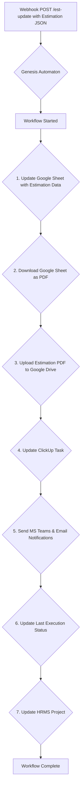

# Genesis Automaton: Estimation Workflow (estimation_workflow.py)

This README documents the project estimation update workflow implemented in `src/core/estimation_workflow.py` (referred to as `Workflow`). This flow is triggered after the initial project setup and is responsible for integrating estimation data into the project's ecosystem.

Genesis Automaton is a webhook-driven system that streamlines the earliest phase of a software project. This document focuses on the second phase: processing and distributing project estimations.

## Project Overview

The estimation workflow is initiated by a webhook that carries estimation data. This data is then processed and distributed to various platforms, ensuring that all stakeholders have access to the latest estimation information.

## Core Features (Estimation Workflow)

*   **Webhook-Driven Automation**: A single `POST /est-update` kicks off the entire estimation update flow.
*   **Google Sheet as PDF**: Downloads the estimation Google Sheet as a PDF.
*   **Google Drive Upload**: Uploads the estimation PDF to the project's Google Drive folder.
*   **ClickUp Task Update**: Updates the corresponding ClickUp task with the estimation details.
*   **Microsoft Teams & Email Notifications**: Sends a detailed estimation summary to the project's Microsoft Teams group chat and via email.
*   **Database Persistence**: Appends the estimation data to a master Google Sheet for tracking and analysis.
*   **HRMS Project Update**: Updates the project in the HRMS portal with the estimated hours.

## System Workflow

The estimation workflow is a sequential, automated pipeline triggered by `POST /est-update`.



Detailed Step Map:

1.  **Update Google Sheet**: Appends the new estimation data to the master project estimation Google Sheet.
2.  **Download Google Sheet as PDF**: Converts the provided Google Sheet URL into a PDF document.
3.  **Upload Estimation to Drive**: Uploads the generated PDF to the project-specific folder in Google Drive.
4.  **Update ClickUp Task**: Adds a link to the estimation PDF in the relevant ClickUp task.
5.  **Send Estimation Mail**: Composes and sends a formatted email and a message to the Teams channel with the estimation details.
6.  **Update Last Execution**: Updates the project's status to "Estimation" in the internal database.
7.  **Update HRMS Project**: Updates the project details in the HRMS system with the new estimation hours.

All long-running operations execute asynchronously relative to the HTTP response.

## Technology Stack

| Category          | Technology / Library                                                                                             |
| ----------------- | ---------------------------------------------------------------------------------------------------------------- |
| **Web Framework**   | aiohttp                                                                    |
| **Data Validation** | Pydantic                                                                            |
| **Configuration**   | python-dotenv                                                       |
| **APIs & Services** | Google Gemini API, Google Drive API, GitHub API, ClickUp API, Microsoft Graph API (Teams & Outlook)                |
| **API Clients**     | `google-genai`, `google-api-python-client`, `PyGithub`, `requests`, `msal`                                 |

## Setup and Installation

1.  **Clone the repository:**

    ```bash
    git clone https://github.com/Relu-Consultancy/genesis-automaton.git
    cd genesis-automaton
    ```

2.  **Install dependencies:**

    ```bash
    uv sync
    ```

3.  **Configure Environment Variables:**
    Create a `.env` file in the root directory of the project and populate it with the necessary credentials and IDs. See `src/core/config.py` for the full list of required variables.

    ```env
    # Google
    GEMINI_API_KEY="YOUR_GEMINI_API_KEY"
    GOOGLE_APPLICATION_CREDENTIALS="path/to/your/gcp-service-account.json"
    GOOGLE_DRIVE_ROOT_FOLDER_ID="YOUR_ROOT_FOLDER_ID"
    GOOGLE_SHEET_ID="YOUR_GOOGLE_SHEET_ID"
    GOOGLE_SHEETS_CREDENTIALS='{"your_json_credentials"}'

    # GitHub
    GITHUB_APP_ID="YOUR_GITHUB_APP_ID"
    GITHUB_ORG="YOUR_GITHUB_ORGANIZATION"
    GITHUB_INSTALLATION_ID="YOUR_APP_INSTALLATION_ID"
    GITHUB_PRIVATE_KEY_PATH="path/to/your/github-app.pem"
    GITHUB_USERNAMES="user1,user2,user3"

    # ClickUp
    CLICKUP_API_KEY="YOUR_CLICKUP_API_KEY"
    CLICKUP_LIST_ID="YOUR_CLICKUP_LIST_ID"

    # Microsoft Teams / Graph API
    MS_USER_CLIENT_ID="YOUR_AZURE_APP_CLIENT_ID"
    MS_USER_TOKEN_CACHE="path/to/your/ms_user_token_cache.json"
    MS_USER_TENANT_ID="YOUR_AZURE_TENANT_ID"
    TEAMS_USER_EMAILS="email1@example.com,email2@example.com"
    MS_APP_GROUP_ID="YOUR_MS_APP_GROUP_ID"

    # HRMS
    HRMS_BASE_URL="YOUR_HRMS_BASE_URL"
    HRMS_EMAIL="YOUR_HRMS_EMAIL"
    HRMS_PASSWORD="YOUR_HRMS_PASSWORD"
    ```

## Running the Server

To start the webhook server, run the main application module:

```bash
uv run main.py
```

The server will start on `http://localhost:8000` by default.

## API Endpoint (Estimation Workflow Trigger)

### POST /est-update

Initiates the estimation update workflow. Returns immediately after queuing background execution.

*   **Payload**: JSON matching `src/models/project_estimation.py`.
*   **Success (200)**:
    `{ "status": "accepted" }`
*   **Error (400)**:
    `{ "status": "error", "message": "..." }`