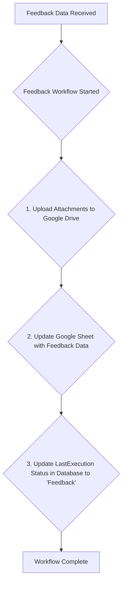

# Genesis Automaton: Project Feedback Workflow (feedback_workflow.py)

This README documents the project feedback workflow implemented in `src/core/feedback_workflow.py`. This workflow is responsible for capturing, processing, and storing client feedback received for a project.

## Project Overview

The feedback workflow is a crucial component of the Genesis Automaton system, designed to handle client feedback submissions. It is triggered when feedback is submitted for a project, and its primary role is to organize and persist this feedback for review and action. The workflow integrates with Google Drive and Google Sheets to ensure that all feedback-related information is stored in a centralized and accessible manner.

## Core Features (Feedback Workflow)

*   **Feedback Data Processing**: Handles incoming feedback data, including project details, review channels, sentiment, and client comments.
*   **Attachment Upload to Google Drive**: If any attachments are provided with the feedback, they are decoded from base64 and uploaded to the project's existing Google Drive folder.
*   **Google Sheets Integration**: Appends a summary of the feedback to a designated Google Sheet, creating a chronological log of all feedback received across projects.
*   **Database Update**: Updates the project's record in the database to indicate that a "Feedback" event was the last executed workflow.

## System Workflow

The feedback workflow is a sequential process that begins when feedback data is received.



**Detailed Step Map:**

1.  **Upload Attachments to Drive**: Any files attached to the feedback submission are decoded and uploaded to the specific project's folder in Google Drive.
2.  **Update Google Sheet**: A new row is appended to the "Project Feedback Submissions" sheet in the designated Google Sheet. This row contains the timestamp, project name, feedback details, and a link to the project's Google Drive folder.
3.  **Update LastExecution Status**: The `LastExecution` field for the project in the database is updated to "Feedback".

## Technology Stack

| Category          | Technology / Library                                                                                             |
| ----------------- | ---------------------------------------------------------------------------------------------------------------- |
| **Data Handling** | Pydantic                                                                            |
| **Configuration**   | python-dotenv                                                       |
| **APIs & Services** | Google Drive API, Google Sheets API                |
| **API Clients**     | `google-api-python-client`, `gspread`                                 |

## Configuration

The feedback workflow relies on several environment variables for its operation. These should be defined in the `.env` file.

```env
# Google
GOOGLE_APPLICATION_CREDENTIALS="path/to/your/gcp-service-account.json"
GOOGLE_DRIVE_ROOT_FOLDER_ID="YOUR_ROOT_FOLDER_ID"
GOOGLE_SHEETS_CREDENTIALS='{"your_google_sheets_credentials_json"}'
GOOGLE_SHEET_ID="YOUR_GOOGLE_SHEET_ID"
```

## Usage

The `FeedbackWorkflow` class is instantiated with feedback data, and the `run()` method is called to execute the workflow. This is typically triggered by an upstream process that receives the feedback from a form or an API endpoint.
